# AIMeet - System Design Document

## 1. Use Case Diagram

```mermaid
graph TB
    User["👤 User"]
    Host["👤 Meeting Host"]
    Participant["👤 Participant"]
    System["🖥️ AIMeet System"]
    OpenAI["🤖 OpenAI"]
    AssemblyAI["📻 AssemblyAI"]
    Qdrant["📊 Qdrant"]
    S3["☁️ AWS S3"]
    Agora["📱 Agora RTC"]

    User -->|Register/Login| System
    User -->|Create Meeting| System
    User -->|Join Meeting| System
    Host -->|Start Recording| System
    Participant -->|Join via Code| System
    Host -->|End Meeting| System
    Host -->|Upload Recording| System
    System -->|Upload Audio| S3
    System -->|Transcribe| AssemblyAI
    AssemblyAI -->|Return Transcript| System
    User -->|Prepare for Search| System
    System -->|Generate Embeddings| OpenAI
    System -->|Store Vectors| Qdrant
    User -->|Ask Question| System
    System -->|Search Vectors| Qdrant
    System -->|Generate Response| OpenAI
    User -->|Upload Document| System
    User -->|Chat| System
    System -->|Video Stream| Agora
    Agora -->|Audio/Video| System

    style User fill:#e1f5ff
    style Host fill:#fff3e0
    style Participant fill:#f3e5f5
    style System fill:#e8f5e9
    style OpenAI fill:#ffebee
    style AssemblyAI fill:#fce4ec
    style Qdrant fill:#f1f8e9
    style S3 fill:#ede7f6
    style Agora fill:#e0f2f1
```



---

## 2. User Flow Diagram

### 2.1 New User Onboarding Flow


### 2.2 Meeting Creation & Participation Flow

```mermaid
flowchart TD
    Host["👤 Host"] --> Create["Click 'Create Meeting'"]
    Create --> AddDetails["Add Title, Description<br/>Set Max Participants"]
    AddDetails --> Generate["System Generates<br/>Room Code"]
    Generate --> Share["Share Code with<br/>Participants"]
    
    Share --> P1["👤 Participant 1"]
    Share --> P2["👤 Participant 2"]
    Share --> PN["👤 Participant N"]
    
    P1 --> Join["Join Meeting<br/>Enter Room Code"]
    P2 --> Join
    PN --> Join
    
    Join --> GetToken["Request Agora Token<br/>from Server"]
    GetToken --> Connect["🎥 Connect to Agora RTC<br/>Start Video/Audio"]
    Connect --> Record["🎙️ Recording Starts<br/>MediaRecorder in Browser"]
    Record --> Chat["💬 Chat Available<br/>Real-time via WebSocket"]
    
    Chat --> MeetingActive["✅ Meeting Active"]
    MeetingActive --> Discussion["Participants Discuss"]
    Discussion --> HostEnd["Host Clicks 'End Meeting'"]
    HostEnd --> RecordingStop["🎙️ Recording Stops<br/>Saved Locally"]
    RecordingStop --> UploadOption["Show Upload Option"]
    
    UploadOption --> Upload["Click 'Upload Recording'"]
    Upload --> S3Upload["📤 Upload to AWS S3<br/>WebM Format"]
    S3Upload --> SaveMetadata["Save Recording URL<br/>in Database"]
    SaveMetadata --> Success["✅ Recording Saved"]

    style Host fill:#fff3e0
    style Create fill:#fff9c4
    style AddDetails fill:#c5e1a5
    style Generate fill:#aed581
    style Share fill:#9ccc65
    style P1 fill:#f3e5f5
    style P2 fill:#f3e5f5
    style PN fill:#f3e5f5
    style Join fill:#e1bee7
    style GetToken fill:#ce93d8
    style Connect fill:#ba68c8
    style Record fill:#ab47bc
    style Chat fill:#9575cd
    style MeetingActive fill:#7986cb
    style Discussion fill:#64b5f6
    style HostEnd fill:#42a5f5
    style RecordingStop fill:#2196f3
    style UploadOption fill:#1976d2
    style Upload fill:#1565c0
    style S3Upload fill:#0d47a1
    style SaveMetadata fill:#1565c0
    style Success fill:#1b5e20
```



### 2.3 Transcription & RAG Pipeline Flow

```mermaid
flowchart TD
    Recording["📂 Recording in S3"] --> Transcribe["Click 'Start Transcription'<br/>or Auto-trigger"]
    Transcribe --> GetURL["Generate Presigned URL<br/>24-hour Expiry"]
    GetURL --> SendAPI["📤 Send to AssemblyAI<br/>with Presigned URL"]
    SendAPI --> ReceiveID["Receive Transcript ID<br/>Status: processing"]
    ReceiveID --> Poll["🔄 Poll Every 3 Seconds<br/>Check Status"]
    
    Poll --> Check{Status?}
    Check -->|Still Processing| Poll
    Check -->|Completed| SaveText["Save Full Transcript<br/>to Database"]
    Check -->|Failed| Error["❌ Show Error<br/>Retry Option"]
    
    SaveText --> Ready["✅ Transcript Ready"]
    Ready --> PrepareClick["User Clicks<br/>'Prepare for Search'"]
    
    PrepareClick --> Chunk["📝 Chunk Transcript<br/>500 tokens, 50 overlap<br/>RecursiveCharacterTextSplitter"]
    Chunk --> CreateChunks["Create TranscriptChunk<br/>Records in DB"]
    CreateChunks --> Embed["🤖 Generate Embeddings<br/>OpenAI text-embedding-3-small<br/>Batch API"]
    Embed --> Vectors["Get 1536-dim Vectors<br/>for All Chunks"]
    Vectors --> StoreQdrant["💾 Store in Qdrant<br/>Vector DB<br/>Cosine Similarity"]
    StoreQdrant --> UpdateFlags["Update MeetingRoom<br/>chunks_created_at<br/>embeddings_created_at"]
    UpdateFlags --> Complete["✅ Ready for Q&A<br/>Searchable"]

    style Recording fill:#f3e5f5
    style Transcribe fill:#e1bee7
    style GetURL fill:#ce93d8
    style SendAPI fill:#ba68c8
    style ReceiveID fill:#ab47bc
    style Poll fill:#9575cd
    style Check fill:#fff9c4
    style SaveText fill:#7986cb
    style Ready fill:#64b5f6
    style PrepareClick fill:#42a5f5
    style Chunk fill:#2196f3
    style CreateChunks fill:#1976d2
    style Embed fill:#1565c0
    style Vectors fill:#0d47a1
    style StoreQdrant fill:#1565c0
    style UpdateFlags fill:#1976d2
    style Complete fill:#1b5e20
    style Error fill:#c62828
```



### 2.4 Question Answering Flow

```mermaid
flowchart TD
    User["👤 User"] --> Question["💭 Ask a Question<br/>About Meeting Content"]
    Question --> Input["Type Question in UI"]
    Input --> Submit["Click 'Ask'"]
    
    Submit --> Embed["🤖 Embed Question<br/>OpenAI API<br/>text-embedding-3-small"]
    Embed --> QueryVector["Get Query Vector<br/>1536 dimensions"]
    
    QueryVector --> Search["🔍 Search Qdrant<br/>Cosine Similarity<br/>Top-5 Chunks"]
    Search --> Results["Get Similar Chunks<br/>+ Relevance Scores<br/>+ Timestamps"]
    
    Results --> History["📜 Retrieve Conversation<br/>Last 5 Q&A Turns<br/>from DB"]
    History --> HistoryData["Past Questions &<br/>Answers Loaded"]
    
    HistoryData --> BuildPrompt["🛠️ Build LLM Prompt"]
    BuildPrompt --> AddSystem["Add System Message<br/>Analysis Instructions"]
    AddSystem --> AddContext["Add Context<br/>Top-5 Chunks<br/>Transcript Sections"]
    AddContext --> AddHistory["Add Conversation<br/>Past Q&A Exchanges"]
    AddHistory --> AddQuery["Add Current Query"]
    AddQuery --> Prompt["Complete Prompt<br/>Ready for LLM"]
    
    Prompt --> CallGPT["📞 Call OpenAI<br/>GPT-4o-mini<br/>Max 1000 tokens"]
    CallGPT --> Generate["Generate Response<br/>with Full Context"]
    Generate --> Response["Get Assistant<br/>Response Text"]
    
    Response --> Save["💾 Save to DB<br/>ConversationHistory<br/>Link Chunks"]
    Save --> Display["📺 Display Answer<br/>to User<br/>Show Relevant Chunks<br/>with Timestamps"]
    Display --> ShowSources["Show Sources<br/>Chunk Text<br/>Confidence Scores"]
    ShowSources --> End["✅ User Sees Answer<br/>with Full Context"]

    style User fill:#e3f2fd
    style Question fill:#bbdefb
    style Input fill:#90caf9
    style Submit fill:#64b5f6
    style Embed fill:#42a5f5
    style QueryVector fill:#2196f3
    style Search fill:#1976d2
    style Results fill:#1565c0
    style History fill:#0d47a1
    style HistoryData fill:#1565c0
    style BuildPrompt fill:#1976d2
    style AddSystem fill:#2196f3
    style AddContext fill:#42a5f5
    style AddHistory fill:#64b5f6
    style AddQuery fill:#90caf9
    style Prompt fill:#bbdefb
    style CallGPT fill:#e3f2fd
    style Generate fill:#bbdefb
    style Response fill:#90caf9
    style Save fill:#64b5f6
    style Display fill:#42a5f5
    style ShowSources fill:#2196f3
    style End fill:#1b5e20
```



### 2.5 Meeting Preparation (Sticky Notes) Flow

```mermaid
flowchart TD
    User["👤 User"] --> CreateNew["Creating New Meeting<br/>for 'Hiring Interview'"]
    CreateNew --> AddTitle["Add Title & Agenda"]
    AddTitle --> System["🤖 System Analyzes<br/>Title Keywords"]
    
    System --> Extract["Extract Keywords<br/>- hiring<br/>- interview<br/>- data science"]
    Extract --> SearchQdrant["🔍 Search Past Meetings<br/>in Qdrant<br/>Similar Topics"]
    SearchQdrant --> FindPast["Find Related Past<br/>Meetings<br/>- Jan 10: Team Formation<br/>- Jan 15: Hiring Discussion<br/>- Jan 20: DS Skills"]
    
    FindPast --> StickyNotes["📌 Show Sticky Notes<br/>Related Past Discussions"]
    StickyNotes --> Display["Display:<br/>'In your last hiring meeting,<br/>you discussed...'"]
    Display --> Expand["User Can Expand<br/>to Read Full Context"]
    Expand --> Context["See Relevant Chunks<br/>from Past Meetings<br/>- Requirements discussed<br/>- Decisions made<br/>- Concerns raised"]
    
    Context --> Prepare["✅ User Prepared<br/>with Full History<br/>Before New Meeting"]

    style User fill:#fff3e0
    style CreateNew fill:#ffe0b2
    style AddTitle fill:#ffcc80
    style System fill:#ffb74d
    style Extract fill:#ffa726
    style SearchQdrant fill:#ff9800
    style FindPast fill:#f57c00
    style StickyNotes fill:#e65100
    style Display fill:#fff9c4
    style Expand fill:#fff59d
    style Context fill:#fff176
    style Prepare fill:#1b5e20
```



---

## 3. System Architecture Diagram

### 3.1 High-Level Architecture


### 3.2 AWS Deployment Architecture

```mermaid
graph TB
    subgraph AWS["☁️ AWS Region ap-south-1"]
        subgraph VPC["VPC"]
            subgraph PublicSubnet["Public Subnet"]
                ALB["ALB<br/>HTTPS"]
            end
            
            subgraph PrivateSubnet["Private Subnet"]
                EC2_1["EC2 Instance 1<br/>Django App"]
                EC2_2["EC2 Instance 2<br/>Django App"]
                EC2_N["EC2 Instance N<br/>Auto-Scaling"]
            end
            
            subgraph DBSubnet["DB Subnet"]
                RDS["RDS PostgreSQL<br/>Multi-AZ"]
            end
        end
        
        S3["S3 Bucket<br/>Recordings, Docs"]
        CloudFront["CloudFront CDN<br/>Static Assets"]
        CloudWatch["CloudWatch<br/>Monitoring"]
        Secrets["Secrets Manager<br/>API Keys"]
    end
    
    Users["👥 Users<br/>Internet"]
    OpenAI_Cloud["🤖 OpenAI<br/>Cloud"]
    Qdrant_Cloud["📊 Qdrant<br/>Cloud"]
    AssemblyAI_Cloud["📻 AssemblyAI<br/>Cloud"]
    Agora_Cloud["📱 Agora<br/>Cloud"]
    
    Users -->|HTTPS| ALB
    ALB -->|Route| EC2_1
    ALB -->|Route| EC2_2
    ALB -->|Route| EC2_N
    EC2_1 -->|Read/Write| RDS
    EC2_2 -->|Read/Write| RDS
    EC2_N -->|Read/Write| RDS
    EC2_1 -->|Upload/Download| S3
    S3 -->|Serve| CloudFront
    EC2_1 -->|Logs| CloudWatch
    EC2_2 -->|Logs| CloudWatch
    EC2_N -->|Logs| CloudWatch
    EC2_1 -->|Get Keys| Secrets
    EC2_1 -->|API Call| OpenAI_Cloud
    EC2_1 -->|API Call| Qdrant_Cloud
    EC2_1 -->|API Call| AssemblyAI_Cloud
    Users -->|Video| Agora_Cloud

    style AWS fill:#ede7f6
    style VPC fill:#f3e5f5
    style PublicSubnet fill:#e1bee7
    style PrivateSubnet fill:#ce93d8
    style DBSubnet fill:#ba68c8
    style Users fill:#bbdefb
    style OpenAI_Cloud fill:#ffebee
    style Qdrant_Cloud fill:#f1f8e9
    style AssemblyAI_Cloud fill:#fce4ec
    style Agora_Cloud fill:#e0f2f1
```



---

## 4. Data Flow Diagram

### 4.1 Recording & Transcription Flow

```mermaid
flowchart LR
    Browser["Browser<br/>MediaRecorder"]
    LocalFile["Local WebM<br/>Audio File<br/>5-50 MB"]
    Django["Django<br/>Backend"]
    Presigned["Presigned URL<br/>24-hour expiry"]
    S3["AWS S3<br/>aimeet-s3-bucket"]
    Assembly["AssemblyAI<br/>Service"]
    Polling["Polling Loop<br/>Every 3 sec"]
    Complete["Transcript<br/>Complete"]
    Database["PostgreSQL<br/>transcript_text"]
    Ready["✅ Ready<br/>for RAG"]
    
    Browser -->|Capture Audio| LocalFile
    LocalFile -->|User Uploads| Django
    Django -->|Generate URL| Presigned
    Django -->|Upload| S3
    S3 -->|Notify| Assembly
    Assembly -->|Process| Polling
    Polling -->|Check Status| Assembly
    Assembly -->|Return Result| Complete
    Complete -->|Save| Database
    Database --> Ready

    style Browser fill:#bbdefb
    style LocalFile fill:#90caf9
    style Django fill:#64b5f6
    style Presigned fill:#42a5f5
    style S3 fill:#2196f3
    style Assembly fill:#ff9800
    style Polling fill:#fff9c4
    style Complete fill:#fff176
    style Database fill:#64b5f6
    style Ready fill:#1b5e20
```



### 4.2 Embedding & Storage Flow


### 4.3 Query & Response Flow


---

## 5. Database Schema Diagram


---

## 6. Component Interaction Diagram

### 6.1 Meeting & Recording Components

```mermaid
graph TB
    FrontEnd["🎨 Frontend<br/>HTML/CSS/JS"]
    DjangoView["📝 Django View<br/>meeting()"]
    AgoraSDK["📱 Agora RTC<br/>SDK"]
    MediaRec["🎙️ MediaRecorder<br/>Audio Capture"]
    RecordingUtils["🛠️ RecordingUtils<br/>S3Manager"]
    S3["☁️ AWS S3"]
    
    FrontEnd -->|render page| DjangoView
    FrontEnd -->|initialize| AgoraSDK
    FrontEnd -->|start recording| MediaRec
    DjangoView -->|generate token| AgoraSDK
    AgoraSDK -->|connect to| FrontEnd
    MediaRec -->|on meeting end| FrontEnd
    FrontEnd -->|upload recording| DjangoView
    DjangoView -->|call| RecordingUtils
    RecordingUtils -->|upload file| S3
    RecordingUtils -->|save metadata| DjangoView

    style FrontEnd fill:#e3f2fd
    style DjangoView fill:#c8e6c9
    style AgoraSDK fill:#e0f2f1
    style MediaRec fill:#fff9c4
    style RecordingUtils fill:#f0f4c3
    style S3 fill:#ede7f6
```



### 6.2 RAG Pipeline Components

```mermaid
graph TB
    AssemblyAI["📻 AssemblyAI<br/>Service"]
    AssemblyUtils["🛠️ AssemblyAI<br/>Utils"]
    DjangoView["📝 Django View<br/>RAG Endpoints"]
    RAGUtils["🛠️ RAG Utils<br/>Chunking & Query"]
    EmbeddingUtils["🛠️ Embedding<br/>Utils"]
    OpenAI["🤖 OpenAI<br/>API"]
    Qdrant["📊 Qdrant<br/>Vector DB"]
    Database["💾 PostgreSQL<br/>Models"]
    
    AssemblyAI -->|transcribe| AssemblyUtils
    AssemblyUtils -->|save| Database
    DjangoView -->|call| RAGUtils
    RAGUtils -->|chunk| Database
    RAGUtils -->|embed| EmbeddingUtils
    EmbeddingUtils -->|call| OpenAI
    EmbeddingUtils -->|store| Qdrant
    RAGUtils -->|query| Qdrant
    RAGUtils -->|generate response| OpenAI
    RAGUtils -->|save history| Database

    style AssemblyAI fill:#ff9800
    style AssemblyUtils fill:#fff9c4
    style DjangoView fill:#c8e6c9
    style RAGUtils fill:#a5d6a7
    style EmbeddingUtils fill:#81c784
    style OpenAI fill:#ffcdd2
    style Qdrant fill:#f1f8e9
    style Database fill:#b3e5fc
```



---

## 7. Sequence Diagrams

### 7.1 Meeting Creation Sequence


### 7.2 Question Answering Sequence


---

## 8. State Machine Diagrams

### 8.1 Meeting State Machine


### 8.2 Transcription State Machine


---

## 9. API Request/Response Flow

### 9.1 Create Meeting Request Flow


### 9.2 Query Meeting Endpoint Request Flow


---

## 10. Error Handling Flow

```mermaid
flowchart TD
    Request["User Request"]
    Try["Try to Process"]
    Check{Error?}
    
    Check -->|No| Success["✅ Success<br/>Return Data"]
    Check -->|Yes| Type{Error Type?}
    
    Type -->|404| NotFound["❌ Not Found<br/>Status 404"]
    Type -->|401| Unauthorized["❌ Unauthorized<br/>Status 401"]
    Type -->|403| Forbidden["❌ Forbidden<br/>Status 403"]
    Type -->|400| BadRequest["❌ Bad Request<br/>Status 400"]
    Type -->|500| ServerError["❌ Server Error<br/>Status 500"]
    Type -->|API Error| APIError["❌ External API<br/>Error"]
    
    NotFound -->|Log| Log["Log Error<br/>to CloudWatch"]
    Unauthorized -->|Log| Log
    Forbidden -->|Log| Log
    BadRequest -->|Log| Log
    ServerError -->|Log| Log
    APIError -->|Log| Log
    
    Log -->|Alert| Alert{Severity?}
    Alert -->|Critical| Page["Page On-Call"]
    Alert -->|Warning| Notify["Send Notification"]
    Alert -->|Info| Store["Store in Log"]
    
    Page -->|Resolved| Response["Return Error<br/>to User"]
    Notify -->|Resolved| Response
    Store -->|Timeout| Response
    
    Request -->|Send| Try
    Success -->|Send| Response

    style Request fill:#e3f2fd
    style Try fill:#fff9c4
    style Check fill:#fff59d
    style Type fill:#fff176
    style Success fill:#c8e6c9
    style NotFound fill:#ffcdd2
    style Unauthorized fill:#ef9a9a
    style Forbidden fill:#e57373
    style BadRequest fill:#ef5350
    style ServerError fill:#f44336
    style APIError fill:#e53935
    style Log fill:#fff9c4
    style Alert fill:#fff59d
    style Page fill:#ff6f00
    style Notify fill:#ffa726
    style Store fill:#ffb74d
    style Response fill:#1b5e20
```

---

## Summary

This design document provides:

1. **Use Cases** - All system actors and interactions
2. **User Flows** - Step-by-step journeys for key scenarios
3. **System Architecture** - Component relationships and deployment
4. **Data Flows** - How data moves through the system
5. **Database Schema** - Entity relationships and structure
6. **Component Interactions** - How modules communicate
7. **Sequences** - Detailed interaction timelines
8. **State Machines** - Meeting and transcription state transitions
9. **API Flows** - Request/response patterns
10. **Error Handling** - Exception management and alerting

All diagrams use Mermaid syntax for easy updates and version control.
